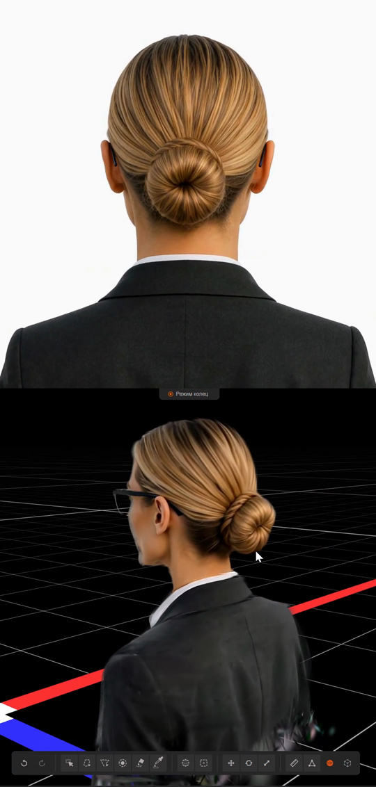

# Video to Gaussian Splat

Minimal batch pipeline for reconstructing a static 3D Gaussian Splat from a
video or an ordered image sequence:

```text
video -> PNG frames -> COLMAP camera solve -> Nerfstudio Splatfacto -> PLY
```

The repository is independent of the source of the video. Input may come from
a real camera, a DCC render, or a generative video model. The important
assumption is that the frames show one predominantly static scene from changing
camera viewpoints.

## Demo

[](docs/assets/h3-orbit-to-gaussian-splat-demo.mp4)

The upper half shows the AI-generated orbit input. The lower half shows the
resulting 3D Gaussian Splat in SuperSplat. Click the preview to open the
[10-second MP4](docs/assets/h3-orbit-to-gaussian-splat-demo.mp4).

## Current research focus

The current research direction is the full generative reconstruction pipeline:

```text
AI image or sparse image references
  -> AI-generated camera-orbit video
  -> camera reconstruction
  -> static 3D Gaussian Splat
```

The goal is to determine when modern image-to-video and reference-to-video
models produce views that are consistent enough for 3D reconstruction, and to
identify practical techniques that improve the result. This includes research
into orbit generation and reference anchoring, frame selection, camera solving,
background and foreground handling, masks, reconstruction strategy, artifact
cleanup, and evaluation.

This research focus does not make a particular AI video model a runtime
dependency. The reconstruction pipeline remains useful for ordinary captured
or rendered video, while generated video is the primary experimental input at
the current stage.

The proposed independent masking and upscaling service, the first local
ComfyUI proof of concept, and the controlled reconstruction comparisons are
recorded in the
[preprocessing App design](docs/preprocessing-app-design.md).
Generated-input confidence, optical-flow, NVOFA, and depth-prior candidates are
tracked in the
[generated-input consistency research notes](docs/generated-input-consistency-research.md).

## Long-term role in generation

The intended output is not only a standalone PLY for viewing. A reconstructed
splat should eventually act as a reusable, camera-controllable 3D prior for
subsequent image and video generation:

```text
references -> generated camera coverage -> Gaussian Splat
                                      |
                                      v
                    aligned RGB / alpha / depth / normals
                                      |
                                      v
                    new image or video generation
```

This creates a possible iterative loop: reconstruct a preliminary scene, render
consistent views or geometry-derived controls, generate missing views, validate
them, and reconstruct again. The splat may therefore serve both as an output and
as structural support for later generation.

This feedback loop is future research, not a currently implemented capability.
Generated or completed surfaces are not ground truth, and support for a
particular conditioning format depends on the downstream generation model. The
ordered experiment plan is maintained in [ROADMAP.md](ROADMAP.md).

MP4 ingestion is not implemented yet. Extract frames first with FFmpeg or
another tool, then upload the ordered PNG sequence.

## What it provides

- validated, immutable job configurations;
- COLMAP feature matching and camera reconstruction;
- automatic selection of the COLMAP sparse model with the most registered
  images;
- Nerfstudio Splatfacto smoke and main training runs;
- Gaussian Splat export to binary PLY;
- batch execution on Modal with an Nvidia L4;
- scale-to-zero operation with no web endpoint or warm GPU pool;
- preparation, training, export, and status reports stored in a Modal Volume.

The current baseline uses ordinary Splatfacto. Both separate binary masks and
RGBA inputs are supported, but the accepted treatment for the first generated
orbit is soft alpha with a random training background. MCMC, automatic PLY
cleanup, direct video ingestion, and held-out evaluation remain future work.

## First experiment

The first end-to-end test used 94 unmasked 768 x 960 frames from a MiniMax H3
generated character orbit. It tested whether an AI-generated orbit was
geometrically consistent enough to act as a static multi-view capture.

| Metric | Result |
|---|---:|
| COLMAP registration | 94 / 94 frames (100%) |
| Camera preparation | 89.8 s |
| Training hardware | Nvidia L4 |
| Splatfacto optimization | 30,000 steps |
| Training time | 830.3 s (13 min 50.3 s) |
| Final reported train loss | 0.0118 |
| Exported Gaussians | 85,834 |
| Exported PLY size | 20.30 MiB |

The reconstruction produced a coherent and recognizable character across novel
views, with some residual floating Gaussians above the head and around the
shoulders. Fixing the training background to white substantially reduced the
large white cloud seen in the initial random-background smoke run.

PSNR, SSIM, and LPIPS were not measured because all frames were used for
training and no held-out evaluation split was defined. See the
[full experiment report](reports/experiment-01-h3-orbit-3dgs.md) for the exact
configuration, timings, artifact identity, limitations, and conclusions.

## Accepted soft-alpha result

The best result in the first experiment series reused the accepted 94-camera
solution and attached 94 native-resolution RGBA frames. The alpha was generated
locally with BiRefNet/VITMatte, adjusted inward by 2 pixels, and blurred by 1
pixel. Splatfacto then composited it over a random background on each iteration.

| Metric | Result |
|---|---:|
| Input | 94 RGBA frames, 768 x 960 |
| Splatfacto optimization | 30,000 steps |
| Training time on Nvidia L4 | 751.74 s |
| Exported Gaussians | 68,899 |
| Exported PLY size | 16.30 MiB |

Visual inspection found that the white silhouette fringe disappeared and the
material background outliers were removed. A small residual below the cropped
bust remains where the source views contain no data. See the
[soft-alpha report](reports/experiment-04-soft-alpha-rgba-3dgs.md).

## Architecture

The deployed Modal App is defined in `modal_app.py`. It exposes named batch
functions through the Modal SDK; it does not expose an HTTP endpoint.

```text
local operator
  -> upload PNG frames to Modal Volume
  -> doctor
  -> prepare (COLMAP)
  -> train (Splatfacto)
  -> export (PLY)
  -> download artifact
```

The deployed App name is `gaussian-splat-trainer` and the Volume name is
`gaussian-splat-runs`. Deploying the code registers the functions. A GPU is
allocated only when a GPU-backed function is invoked.

## Cost boundary

The following are separate external actions:

- `modal volume put` uploads input data;
- `modal deploy` updates the deployed App but does not itself launch training;
- `doctor` briefly allocates an L4 for runtime verification;
- `prepare` allocates an L4 for COLMAP;
- `train` allocates an L4 for optimization;
- `export` allocates an L4 to load the checkpoint and produce a PLY.

GPU functions use `min_containers=0`, `buffer_containers=0`,
`max_containers=1`, `scaledown_window=2`, and `retries=0`. The GPU container
scales to zero after work completes.

## Environment

The Modal image is pinned to:

```text
ghcr.io/nerfstudio-project/nerfstudio:1.1.5
```

Install and authenticate the local Modal client:

```powershell
python -m pip install "modal>=1.5,<2"
modal setup
```

Offline checks use only the Python standard library:

```powershell
python -m unittest discover -s tests -v
```

## Configure a job

Copy `configs/example.json` to a new file under `configs/`, then replace its
placeholder path, image count, dimensions, sequence manifest, and run IDs. A
job records the camera solve and training settings. Existing preparations,
runs, and exports are never overwritten.

The completed first test is recorded in:

```text
configs/mix_back_clean_v1_largest_model_white.json
```

Use a new `job_id` when the input sequence or camera preparation changes. Use a
new run ID when the method, strategy, background, mask policy, or step count
changes.

## Run a job

The examples below assume `$modalPython` points to an authenticated Python
interpreter and `$config` points to the selected job configuration:

```powershell
$modalPython = "python"
$config = "configs/your_job.json"
```

Create the Volume and upload an ordered PNG directory to the job's input path:

```powershell
& $modalPython -m modal volume create gaussian-splat-runs -e main

& $modalPython -m modal volume put gaussian-splat-runs `
  "D:\path\to\frames" `
  /jobs/your-job-id/input `
  -e main
```

Deploy the batch functions:

```powershell
& $modalPython -m modal deploy modal_app.py -e main
```

Verify the runtime, then solve cameras:

```powershell
& $modalPython control.py --config $config --stage doctor
& $modalPython control.py --config $config --stage prepare
```

Inspect the preparation report and camera trajectory before training. Then run
and export a bounded smoke test:

```powershell
& $modalPython control.py --config $config --stage train --kind smoke
& $modalPython control.py --config $config --stage export --kind smoke
```

Launch and export the main run only after accepting the smoke result:

```powershell
& $modalPython control.py --config $config --stage train --kind main
& $modalPython control.py --config $config --stage export --kind main
```

### Historical foreground-mask experiment

The first masked comparison reuses the accepted 94-camera solution and creates
an immutable derived Nerfstudio dataset. It does not modify the baseline
`processed/` directory or its training runs.

Upload the reviewed one-channel masks under their frozen mask identity:

```powershell
$config = "configs/mix_back_clean_v1_masked_birefnet.json"

& $modalPython -m modal volume put gaussian-splat-runs `
  "Input/test 2/Splat_test_2_mask_1ch" `
  "/jobs/mix-back-clean-v1-largest-model/masks/birefnet-binary-v1" `
  -e main

& $modalPython control.py --config $config --stage attach-masks
& $modalPython control.py --config $config --stage train --kind smoke
& $modalPython control.py --config $config --stage export --kind smoke
```

Inspect the smoke export before separately authorizing the 30,000-step run:

```powershell
& $modalPython control.py --config $config --stage train --kind main
& $modalPython control.py --config $config --stage export --kind main
```

`attach-masks` verifies count, dimensions, one-channel PNG encoding, and the
frozen mask manifest before adding one `mask_path` to each registered frame.
This binary-mask comparison was visually rejected; it remains documented as a
reproducible negative result.

### Soft-alpha RGBA input

RGBA inputs can reuse a compatible, already accepted camera solution. Upload
the RGBA sequence to the job input path, configure `rgba.enabled`,
`rgba.dataset_id`, and `rgba.camera_source_job_id`, then run:

```powershell
& $modalPython control.py --config $config --stage attach-rgba
& $modalPython control.py --config $config --stage train --kind smoke
& $modalPython control.py --config $config --stage export --kind smoke
```

Do not enable both `rgba` and separate `masks` for the same job. Camera reuse is
valid only when the RGBA filenames, dimensions, ordering, and scene views match
the source camera solution.

Status is read through the Modal SDK and does not request a GPU:

```powershell
& $modalPython control.py --config $config --stage status
```

Download artifacts with `modal volume get` after checking the exact remote path
returned by the export report.

## Repository layout

```text
modal_app.py     Modal App, Volume, images, and batch functions
control.py       local SDK client for deployed functions
splat_job.py     validation and command construction
configs/         immutable experiment configurations
docs/            design notes and research plans
reports/         experiment results and limitations
tests/           offline unit tests
```

## Current limitations

- input must already be an ordered PNG sequence;
- reconstruction assumes a static scene;
- foreground treatment is optional and must be selected per job;
- residual or disconnected Gaussians are not automatically removed;
- the default first-test protocol has no held-out view metrics;
- successful COLMAP registration does not guarantee geometrically correct
  unseen surfaces.

## Data and third-party software

Source videos, frames, model checkpoints, trained splats, credentials, and
Modal Volume contents are not included in this repository. Users are
responsible for the rights to their inputs and outputs. The runtime builds on
Modal, COLMAP, Nerfstudio, and gsplat; consult each upstream project for its
license and usage terms.

Historical experiment configs intentionally preserve provenance metadata such
as local source paths and Modal job IDs. Copy and adapt them rather than
expecting them to run unchanged on another machine.

## License

This repository is released under the [Apache License 2.0](LICENSE).
